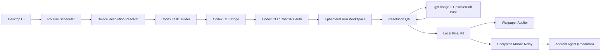

# Auto Ducktape Wallpapers

[English README](README.md)

Auto Ducktape Wallpapers는 예약된 AI 바탕화면 생성을 위한 실험적 Codex CLI wrapper입니다. 이 앱은 OpenAI API를 직접 호출하지 않습니다. 대신 루틴 설정, 사용자 지시사항, 기기 프로필, 대상 해상도를 모아서 `codex exec`에 작업을 넘깁니다.

Codex는 사용자 지시사항을 이미지 프롬프트로 바꾸고, `gpt-image-2`로 바탕화면 이미지를 생성하고, 결과 manifest를 작성합니다. 앱은 스케줄링, 해상도 감지, 결과 검증, 후처리 정책 집행, 바탕화면 적용을 담당합니다.

## 상태

현재 저장소는 초기 POC 단계입니다. 포함된 내용은 다음과 같습니다.

- 아키텍처와 Codex CLI 계약 문서
- Codex 작업 명세 생성을 위한 최소 Node workspace
- 스마트폰 해상도 catalog seed
- 생성 전 작업 명세를 확인하는 dry-run 명령
- 생성, 파일명, 후처리, 보관 정책, scheduler, 데모 루틴 기본값을 바꾸는 루트 `settings.json`
- 월 1회 휴지통 정리 계획을 확인하는 retention cleanup dry-run
- DB 없는 암호화 이미지 전달을 확인하는 mobile relay dry-run
- macOS에서 Codex 생성 이미지를 바탕화면으로 적용한 수동 검증 경로

데스크톱 UI, 네이티브 모니터 감지, Windows용 프로덕션 바탕화면 적용 모듈, mobile relay server, Android agent는 아직 구현 전입니다.

## 목표

- Codex CLI를 유일한 생성 인터페이스로 사용합니다.
- 이미지 생성과 이미지 기반 고해상도 보강은 `gpt-image-2`만 사용합니다.
- 앱에서 OpenAI API를 직접 호출하지 않습니다.
- 생성 이미지 히스토리용 로컬 애셋 스토어를 만들지 않습니다.
- 모바일 이미지는 DB 없는 암호화 relay로만 전달합니다.
- 짧은 지시사항과 상세 프롬프트를 모두 지원합니다.
- Windows, macOS, Android 기기별 바탕화면을 생성합니다.
- iOS는 네이티브 자동화 제약이 크므로 후순위 로드맵으로 둡니다.

## 하지 않는 것

- 앱 안에서 OpenAI API key 입력 흐름을 만들지 않습니다.
- OpenAI SDK를 직접 사용하지 않습니다.
- 다른 이미지 모델로 fallback하지 않습니다.
- 생성 이미지 히스토리를 영구 보관하지 않습니다.
- 초기 범위에 iOS 앱을 포함하지 않습니다.

## 사전 요구사항

- 데스크톱 오케스트레이터용 macOS 또는 Windows
- Node.js 20 이상
- npm
- `codex` 명령으로 실행 가능한 Codex CLI
- Codex에 로그인된 ChatGPT 계정
- Codex 사용 권한이 포함된 ChatGPT 플랜. OpenAI 공식 문서 기준 Codex는 ChatGPT Plus, Pro, Business, Edu, Enterprise 플랜에 포함됩니다.

현재 macOS POC에서는 다음 도구도 사용합니다.

- `sips`: 이미지 해상도 확인과 최종 캔버스 맞춤
- `swift`: macOS `NSWorkspace` 기반 바탕화면 적용
- `osascript`: 기본값에서는 꺼져 있으며, `AUTO_DUCKTAPE_ALLOW_OSASCRIPT_FALLBACK=1`을 설정했을 때만 사용합니다. Finder/System Events를 AppleScript로 제어하면 macOS Automation 권한 팝업이 뜰 수 있기 때문입니다.

이 프로젝트는 의도적으로 `OPENAI_API_KEY`를 요구하지 않습니다.

## Quick Start

저장소를 받은 뒤 workspace 메타데이터를 설치합니다.

```bash
npm install
```

Codex CLI가 설치되어 있는지 확인합니다.

```bash
codex --version
```

필요하다면 ChatGPT 계정으로 Codex에 로그인합니다.

```bash
codex login
```

샘플 바탕화면 작업 명세를 확인합니다.

```bash
npm run demo:task
```

`settings.json`에서 생성 동작을 수정한 뒤 같은 명령으로 결과 작업 명세를 다시 확인할 수 있습니다.

실제 이미지를 생성하지 않고 `codex exec` 호출 계획과 프롬프트를 확인합니다.

```bash
npm run codex:dry-run
```

월 1회 retention cleanup 계획을 확인합니다.

```bash
npm run retention:dry-run
```

모바일 relay 계약 계획을 확인합니다.

```bash
npm run mobile-relay:dry-run
```

현재 scheduler 계획을 확인합니다.

```bash
npm run scheduler:plan
```

생성/적용을 한 번 실행합니다.

```bash
npm run run-once
```

10분 루틴을 foreground에서 계속 실행합니다.

```bash
npm run scheduler:run
```

macOS 백그라운드 scheduler를 설치합니다.

```bash
npm run scheduler:install
```

상태 확인 또는 제거:

```bash
npm run scheduler:status
npm run scheduler:uninstall
```

## 아키텍처



## 설정

대부분의 POC 동작은 [settings.json](settings.json)에서 제어합니다.

```json
{
  "codex": {
    "command": "codex",
    "args": ["exec", "--json", "--sandbox", "workspace-write", "-"],
    "imageModel": "gpt-image-2",
    "fallback": "disabled",
    "timeoutSeconds": 600
  },
  "postProcessing": {
    "maxGptImage2UpscaleAttempts": 0,
    "onUpscaleFailure": "select_best_available_image_for_target",
    "completionPriority": "apply_best_available_before_timeout"
  },
  "simplePromptRandomization": {
    "enabled": true,
    "generator": "codex",
    "mode": "always_for_simple_prompts",
    "dimensions": {
      "contentTwist": ["a tiny story implied by one object"],
      "composition": ["wide negative space on one side for desktop icons"],
      "mood": ["soft and heartwarming"],
      "surpriseDetail": ["one tiny object that rewards a second look"]
    }
  },
  "runtimeFallback": {
    "enabled": true,
    "onCodexFailure": "apply_latest_generated_desktop_candidate",
    "generatedImagesRoot": "~/.codex/generated_images"
  },
  "retention": {
    "schedule": "monthly",
    "olderThanDays": 30,
    "action": "move_to_trash"
  },
  "mobileRelay": {
    "enabled": false,
    "mode": "ephemeral_object_relay",
    "provider": "cloudflare_workers_r2",
    "database": "disabled",
    "imageRetentionHours": 24,
    "deleteAfterAck": true
  },
  "routines": {
    "demo": {
      "name": "Surprise Wallpapers",
      "userInstruction": "Generate a fresh, pleasant desktop wallpaper with a clean composition, soft colors, and icon-friendly negative space.",
      "schedule": {
        "kind": "interval",
        "everyMinutes": 10,
        "runOnlyWhenComputerAwake": true
      }
    }
  }
}
```

주요 설정:

- `codex.imageModel`: Codex가 사용해야 하는 이미지 모델입니다. 이 프로젝트는 `gpt-image-2`를 전제로 합니다.
- `codex.args`: wrapper가 사용할 정확한 `codex exec` 호출 인자입니다.
- `codex.timeoutSeconds`: Codex 생성 pass 하나를 기다리는 최대 시간입니다.
- `output.directory`: 생성 파일을 둘 runtime output 경로입니다.
- `naming.imageFilenamePattern`: 바탕화면 파일명 패턴입니다. `{promptSlug}`를 넣으면 Codex가 final prompt에서 짧은 이름을 만들고, 앱은 `{targetId}`와 `{timestamp}`로 추적 가능성을 유지합니다.
- `postProcessing.maxGptImage2UpscaleAttempts`: 해상도 보강 토큰 사용을 제한하는 횟수입니다. 기본 루틴은 `0`으로 두어 첫 usable 이미지를 바로 적용합니다.
- `postProcessing.onUpscaleFailure`: 시도 제한 이후 fallback 동작입니다.
- `simplePromptRandomization`: simple prompt 확장 전에 Codex가 중간 랜덤 스크립트를 직접 작성할 때 사용하는 후보 메뉴와 가드레일입니다.
- `runtimeFallback`: Codex worker가 manifest 작성 전에 timeout되면, 이미 생성된 데스크톱 후보 이미지를 골라 적용하는 동작입니다.
- `retention.olderThanDays`: 월 1회 휴지통 정리 대상 나이 기준입니다.
- `runCleanup.keepPreviousRunCount`: 새 바탕화면 적용 후 보존할 이전 성공 루틴 주기 수입니다. `0`이면 현재 주기만 남기고, `20`이면 현재 주기에 더해 이전 20주기를 남깁니다.
- `mobileRelay`: 다른 네트워크의 Android 기기로 이미지를 전달하기 위한 DB 없는 암호화 relay 계획입니다.
- `routines.demo`: `npm run demo:task`가 사용하는 기본 데모 루틴이며, 현재 테스트용 10분 interval로 설정되어 있습니다.
- `routines.demo.promptVariation`: 반복 루틴이 비슷한 장면으로 수렴하지 않도록 Codex가 참고하는 루틴별 창작 슬롯입니다.
- `routines.demo.schedule.runOnlyWhenComputerAwake`: scheduler 의도를 명시하는 설정입니다. macOS LaunchAgent는 Mac이 켜져 있고 깨어 있으며 사용자 세션이 있을 때만 실행되고, 컴퓨터를 깨우지 않습니다.

`scheduler:run`은 foreground process입니다. 테스트 중에는 터미널을 열어둬야 하며, 터미널을 닫으면 10분 루틴도 멈춥니다.

macOS에서 백그라운드로 계속 돌리려면 `scheduler:install`을 사용합니다. 이 명령은 `~/Library/LaunchAgents/com.autoducktape.wallpapers.scheduler.plist`를 만들고, `settings.json`의 interval에 맞춰 `npm run run-once`를 실행합니다.

이 방식은 user LaunchAgent라서 Mac이 켜져 있고 잠자기 상태가 아니며 사용자 세션이 살아 있을 때만 실행됩니다. 컴퓨터가 꺼져 있거나 잠자기 중일 때 놓친 실행을 cloud worker가 대신 만들지 않습니다.

`runCleanup.deletePreviousMacosWallpaperCachesOnSuccess`가 켜져 있으면 macOS가 `node`의 wallpaper cache 접근 허용 여부를 물을 수 있습니다. 반복 팝업을 피하려면 LaunchAgent가 쓰는 Node 실행 파일에 Full Disk Access를 부여합니다.

1. 시스템 설정 > 개인정보 보호 및 보안 > 전체 디스크 접근 권한을 엽니다.
2. `+`를 누른 뒤 `Cmd+Shift+G`를 누릅니다.
3. 실제 Node 경로를 추가합니다. 예: `/opt/homebrew/Cellar/node/25.9.0_1/bin/node`
4. Homebrew로 Node가 업데이트되어 Cellar 경로가 바뀌면 새 경로를 다시 추가합니다.

다른 설정 파일을 지정할 수도 있습니다.

```bash
AUTO_DUCKTAPE_SETTINGS=/path/to/settings.json npm run demo:task
```

### 핵심 흐름

1. 사용자가 루틴을 만듭니다.
2. 앱이 대상 기기와 정확한 바탕화면 해상도를 확정합니다.
3. 앱이 Codex 작업 명세를 만듭니다.
4. 앱이 `codex exec --json --sandbox workspace-write -`를 실행합니다.
5. Codex가 짧은 지시사항을 확장하거나 상세 프롬프트를 보존합니다.
6. Codex가 `gpt-image-2`로 이미지를 생성합니다.
7. 앱이 manifest와 이미지 해상도를 검증합니다.
8. 기본 자동 루틴에서는 이미지가 target보다 작아도 best-available 후보를 즉시 선택합니다.
9. 수동/고품질 프로필에서만 같은 Codex 세션으로 `gpt-image-2` 업스케일/편집 pass를 제한 횟수만큼 시도합니다.
10. 해상도 보강이 꺼져 있거나 계속 실패하면 가장 나은 후보 이미지를 그대로 적용합니다.
11. 앱이 바탕화면을 적용하고 임시 파일을 정리합니다.

## 해상도 정책

앱은 정확한 target 해상도를 성공 조건으로 봅니다.

우선순위는 다음과 같습니다.

1. **Native target generation**
   - Codex에 `gpt-image-2`로 처음부터 대상 해상도 생성을 요청합니다.

2. **같은 세션의 GPT Image 2 보강**
   - 생성 이미지가 target보다 작으면 Codex 세션을 유지합니다.
   - 생성된 이미지를 다시 `gpt-image-2`에 입력합니다.
   - 구도와 분위기를 유지하면서 대상 기기 해상도에 맞게 디테일과 크기를 높여 달라고 요청합니다.
   - target당 설정된 횟수까지만 시도합니다.
   - 이 단계는 기본 자동 루틴에서는 꺼져 있습니다. 고품질/수동 프로필에서는 `postProcessing.maxGptImage2UpscaleAttempts`를 `1` 이상으로 올리면 됩니다.

3. **Best available fallback**
   - target 해상도 달성에 계속 실패하면 비율, 픽셀 면적, 시각적 적합성을 기준으로 가장 나은 후보 이미지를 고릅니다.
   - 루틴 작업이므로 토큰을 계속 쓰기보다 적당한 이미지를 적용하는 것을 우선합니다.
   - 로컬 리사이즈/캔버스 맞춤은 마지막 호환성 단계로만 사용하고, 사용 시 manifest warnings에 기록합니다.

4. **Runtime fallback**
   - `codex exec`가 timeout되거나 `out/manifest.json` 작성 전에 종료되면 wrapper가 `~/.codex/generated_images`를 스캔합니다.
   - 최근 생성된 데스크톱 비율 PNG를 골라 timestamp 파일명으로 `out`에 복사하고, fallback manifest를 작성한 뒤 적용합니다.

현재 macOS 검증에서 이 정책이 필요하다는 점이 확인됐습니다. Codex가 이미지를 성공적으로 생성했지만 최초 산출물은 요청한 3840x2160보다 작았고, 최종 파일을 만들기 위해 후처리가 필요했습니다.

## 파일명과 보관 정책

생성 이미지 파일명에는 timestamp를 포함해야 합니다.

```text
{routineId}-{targetId}-{timestamp}.png
```

예시:

```text
morning-focus-main-monitor-20260504T061930Z.png
```

생성 이미지는 런타임 산출물이지만, OS가 현재 바탕화면 파일을 참조할 수 있으므로 일부 파일은 디스크에 남아야 할 수 있습니다. 폴더가 계속 커지는 것을 막기 위해 앱은 월 1회 정리 작업을 실행하고, 생성 후 30일이 지난 이미지를 시스템 휴지통으로 옮깁니다.

## 모바일 Relay

Android 기기는 별도 companion app이 필요합니다. Android 바탕화면 적용은 기기 안에서 `WallpaperManager`를 통해 수행해야 하기 때문입니다. 같은 네트워크에서는 desktop app과 Android app이 직접 통신할 수 있지만, 다른 네트워크에서는 암호화된 이미지 객체만 잠깐 중계하는 저비용 relay를 사용합니다.

Relay는 의도적으로 DB를 쓰지 않습니다.

- relay는 Cloudflare Workers 기반 stateless HTTP service를 계획합니다.
- 바탕화면 파일과 sidecar manifest는 Cloudflare R2 같은 임시 object storage에 암호화된 객체로만 둡니다.
- object key는 계정 row 대신 high-entropy pairing namespace를 사용합니다.
- 객체는 짧은 retention window 이후 만료되고, Android 적용 ack 이후 삭제됩니다.
- relay는 Codex를 실행하지 않고, OpenAI credential을 받지 않으며, 이미지 내용을 읽을 수 없어야 합니다.

모바일 전달 흐름:

1. Desktop이 Codex와 `gpt-image-2`로 Android target 바탕화면을 생성합니다.
2. Desktop이 paired Android device용으로 이미지를 암호화합니다.
3. Desktop이 암호화된 이미지와 암호화된 sidecar manifest를 relay에 업로드합니다.
4. Android가 reachable할 때 최신 pending job을 가져옵니다.
5. Android가 로컬에서 복호화하고 바탕화면에 적용합니다.
6. Android가 ack를 보내면 relay가 job 객체를 삭제합니다.

## 프롬프트 모드

### Simple Mode

사용자는 짧게 지시합니다.

```text
Calm cozy wallpaper for a focused morning desktop
```

Codex는 `simplePromptRandomization`과 루틴별 `promptVariation` 슬롯을 참고해 먼저 중간 랜덤 스크립트를 직접 작성한 뒤, 짧은 지시사항을 바탕화면용 이미지 프롬프트로 확장합니다. prompt slug 파일명이 켜져 있으면 Codex가 final prompt에서 파일명 slug도 만듭니다.

### Advanced Mode

사용자가 상세 이미지 프롬프트를 직접 작성합니다. 앱은 target 해상도, safe area, 기기 컨텍스트를 함께 넘기지만, Codex는 사용자의 창작 의도를 최대한 보존해야 합니다.

## 프로젝트 구조

```text
.
├── apps
│   └── desktop
│       └── src
│           ├── codex
│           ├── config
│           ├── devices
│           ├── maintenance
│           ├── mobile
│           ├── platform
│           ├── routines
│           └── tasks
├── docs
│   ├── architecture.md
│   ├── codex-cli-contract.md
│   └── poc-plan.md
├── README.md
├── README.ko.md
└── settings.json
```

## 로드맵

- Codex CLI 실행 wrapper와 세션 유지
- Manifest validator
- Resolution QA와 같은 세션의 `gpt-image-2` 업스케일/편집 pass
- 업스케일/편집이 꺼져 있거나 제한 횟수를 소진했을 때 best-available fallback
- 30일 지난 생성 이미지를 월 1회 휴지통으로 옮기는 retention cleaner 구현
- macOS 모니터 감지와 `NSWorkspace` 바탕화면 적용
- Windows 모니터 감지와 `IDesktopWallpaper` 바탕화면 적용
- 백그라운드/패키지형 루틴 스케줄러
- Android 모델 catalog와 Android agent
- 임시 object storage 기반 DB 없는 암호화 mobile relay
- 스마트폰 프로필 원격 업데이트
- iOS Shortcuts 실험

## 보안

- 앱은 `~/.codex/auth.json`을 읽거나 복사하지 않습니다.
- 앱은 Codex access token을 저장하지 않습니다.
- mobile relay는 Codex 실행, shell 접근, 임의 파일 읽기를 노출하면 안 됩니다.
- mobile relay payload는 업로드 전에 end-to-end encryption을 적용해야 합니다.
- 사용자 프롬프트와 최종 프롬프트는 루틴 메타데이터로 저장할 수 있지만, 사용자가 끌 수 있어야 합니다.
- 생성 이미지는 런타임 산출물이며 영구 컬렉션이 아닙니다. 30일이 지난 파일은 월 1회 cleaner가 휴지통으로 옮겨야 합니다.

## 참고

- [Codex app](https://developers.openai.com/codex/app)
- [Codex non-interactive mode](https://developers.openai.com/codex/noninteractive)
- [GPT Image 2 model](https://developers.openai.com/api/docs/models/gpt-image-2)
- [Image generation guide](https://developers.openai.com/api/docs/guides/image-generation)
- [Cloudflare Workers pricing](https://workers.cloudflare.com/pricing)
- [Cloudflare R2 pricing](https://developers.cloudflare.com/r2/pricing/)
- [Cloudflare R2 object lifecycles](https://developers.cloudflare.com/r2/buckets/object-lifecycles/)

## 라이선스

TBD.
