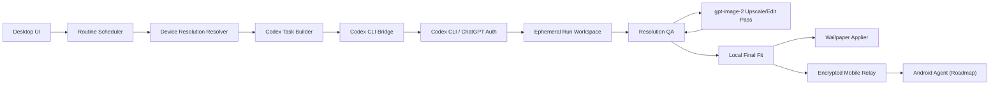

# Auto Ducktape Wallpapers

[한국어 README](README.ko.md)

Auto Ducktape Wallpapers is an experimental Codex CLI wrapper for scheduled AI wallpaper generation. It does not call the OpenAI API directly. Instead, it collects routine settings, prompt intent, device profiles, and target resolutions, then hands the whole job to `codex exec`.

Codex is responsible for turning user instructions into image prompts, generating wallpapers with `gpt-image-2`, and producing a manifest. The app is responsible for scheduling, resolution detection, result validation, post-processing policy enforcement, and wallpaper application.

## Status

This repository is an early POC. The current codebase contains:

- Architecture and Codex CLI contract documents
- A minimal Node workspace for Codex task generation
- A phone resolution catalog seed
- Dry-run commands for inspecting the generated Codex task
- A root `settings.json` file for changing generation, naming, post-processing, retention, scheduler, and demo routine defaults
- A retention cleanup dry-run plan for monthly Trash/Recycling Bin cleanup
- A mobile relay dry-run plan for DB-less encrypted image handoff
- A verified manual macOS test path for Codex-generated wallpaper output

The desktop UI, native monitor detection, production Windows wallpaper applier, mobile relay server, and Android agent are not implemented yet.

## Goals

- Use Codex CLI as the only generation interface.
- Use `gpt-image-2` only for image generation and image-based resolution enhancement.
- Avoid direct OpenAI API calls from this app.
- Avoid storing a local wallpaper library.
- Use a DB-less relay only for encrypted mobile image handoff.
- Support both short user instructions and advanced image prompts.
- Generate device-specific wallpapers for Windows, macOS, and Android.
- Treat iOS as a late roadmap item because native wallpaper automation is constrained.

## Non-goals

- No OpenAI API key flow in the app.
- No direct OpenAI SDK usage.
- No fallback to other image models.
- No permanent local asset store for generated image history.
- No iOS app in the initial scope.

## Prerequisites

- macOS or Windows for the desktop orchestrator.
- Node.js 20 or newer.
- npm.
- Codex CLI installed and available as `codex`.
- A ChatGPT account signed in through Codex.
- A ChatGPT plan that includes Codex access. OpenAI currently documents Codex as included with ChatGPT Plus, Pro, Business, Edu, and Enterprise plans.

For the current macOS POC:

- `sips` is used for local image inspection/final canvas fitting.
- `osascript` can be used as a temporary wallpaper application fallback.

This project intentionally does not require `OPENAI_API_KEY`.

## Quick Start

Clone the repo and install workspace metadata:

```bash
npm install
```

Check that Codex CLI is installed:

```bash
codex --version
```

Sign in to Codex with your ChatGPT account if needed:

```bash
codex login
```

Inspect the sample wallpaper task:

```bash
npm run demo:task
```

Edit generation behavior in `settings.json`, then run the same command again to inspect the resulting task.

Inspect the planned `codex exec` call and prompt without generating an image:

```bash
npm run codex:dry-run
```

Inspect the monthly retention cleanup plan:

```bash
npm run retention:dry-run
```

Inspect the planned mobile relay contract:

```bash
npm run mobile-relay:dry-run
```

Inspect the scheduler plan:

```bash
npm run scheduler:plan
```

Run one generation/apply pass:

```bash
npm run run-once
```

Keep the 10-minute routine running in the foreground:

```bash
npm run scheduler:run
```

Install the macOS background scheduler:

```bash
npm run scheduler:install
```

Check or remove it:

```bash
npm run scheduler:status
npm run scheduler:uninstall
```

## Architecture



## Configuration

Most POC behavior is controlled from [settings.json](settings.json).

```json
{
  "codex": {
    "command": "codex",
    "args": ["exec", "--json", "--sandbox", "workspace-write", "-"],
    "imageModel": "gpt-image-2",
    "fallback": "disabled",
    "timeoutSeconds": 600
  },
  "postProcessing": {
    "maxGptImage2UpscaleAttempts": 0,
    "onUpscaleFailure": "select_best_available_image_for_target",
    "completionPriority": "apply_best_available_before_timeout"
  },
  "runtimeFallback": {
    "enabled": true,
    "onCodexFailure": "apply_latest_generated_desktop_candidate",
    "generatedImagesRoot": "~/.codex/generated_images"
  },
  "retention": {
    "schedule": "monthly",
    "olderThanDays": 30,
    "action": "move_to_trash"
  },
  "mobileRelay": {
    "enabled": false,
    "mode": "ephemeral_object_relay",
    "provider": "cloudflare_workers_r2",
    "database": "disabled",
    "imageRetentionHours": 24,
    "deleteAfterAck": true
  },
  "routines": {
    "demo": {
      "name": "Cute Cat Wallpapers",
      "userInstruction": "Generate varied cute cat wallpapers with different breeds, poses, expressions, seasons, and soft uncluttered desktop-friendly backgrounds.",
      "schedule": {
        "kind": "interval",
        "everyMinutes": 10,
        "runOnlyWhenComputerAwake": true
      }
    }
  }
}
```

Important settings:

- `codex.imageModel`: image model Codex must use. The project expects `gpt-image-2`.
- `codex.args`: exact `codex exec` invocation used by the wrapper.
- `codex.timeoutSeconds`: maximum wait time for one Codex generation pass.
- `output.directory`: runtime output directory for generated files.
- `naming.imageFilenamePattern`: timestamped wallpaper filename pattern.
- `postProcessing.maxGptImage2UpscaleAttempts`: token guardrail for resolution enhancement. The default routine uses `0` so scheduled runs apply the first usable image.
- `postProcessing.onUpscaleFailure`: fallback behavior after the attempt limit.
- `runtimeFallback`: applies the best desktop candidate already generated by Codex if the worker times out before writing a manifest.
- `retention.olderThanDays`: age threshold for monthly Trash/Recycling Bin cleanup.
- `mobileRelay`: planned DB-less encrypted image relay for Android devices on other networks.
- `routines.demo`: default demo routine used by `npm run demo:task`; currently set to a 10-minute interval for testing.
- `routines.demo.schedule.runOnlyWhenComputerAwake`: documents the intended scheduler behavior. The macOS LaunchAgent only runs while the Mac is awake and the user session is available; it does not wake the computer.

`scheduler:run` is a foreground process. Keep the terminal open while testing; closing it stops the 10-minute routine.

For macOS background operation, use `scheduler:install`. It creates a LaunchAgent at `~/Library/LaunchAgents/com.autoducktape.wallpapers.scheduler.plist` that runs `npm run run-once` at the interval from `settings.json`.

Because this is a user LaunchAgent, scheduled runs happen only while the Mac is powered on, awake, and in the user session. Missed runs while the computer is off or asleep are not generated by a cloud worker.

You can also point the app at another settings file:

```bash
AUTO_DUCKTAPE_SETTINGS=/path/to/settings.json npm run demo:task
```

### Core Flow

1. The user creates a routine.
2. The app resolves target devices and exact wallpaper dimensions.
3. The app builds a Codex task spec.
4. The app runs `codex exec --json --sandbox workspace-write -`.
5. Codex expands the instruction or preserves the advanced prompt.
6. Codex generates images with `gpt-image-2`.
7. The app validates the manifest and image dimensions.
8. For scheduled routines, if an image is too small, the app selects the best available candidate immediately.
9. For manual/high-quality profiles, the same Codex session may send that image back to `gpt-image-2` for a capped upscale/edit pass.
10. If resolution enhancement is disabled or still fails, the app applies the best available candidate anyway.
11. The app applies the wallpaper and cleans up transient files.

## Resolution Policy

The app treats exact target dimensions as part of correctness.

Preferred order:

1. **Native target generation**
   - Ask Codex to generate with `gpt-image-2` at the requested target size.

2. **Same-session GPT Image 2 enhancement**
   - If the generated image is smaller than the target, keep the Codex session alive.
   - Send the generated image back to `gpt-image-2`.
   - Ask it to preserve the composition and raise the output resolution/detail for the target device.
   - Stop after the configured attempt limit per target.
   - This is disabled by default for scheduled routines. Set `postProcessing.maxGptImage2UpscaleAttempts` above `0` for a higher-quality/manual profile.

3. **Best available fallback**
   - If the target resolution still fails, choose the best available candidate by aspect ratio, pixel area, and visual suitability.
   - The routine should still apply a wallpaper instead of burning more tokens.
   - Use local resizing/canvas fitting only as a final compatibility step, and record it in manifest warnings.

4. **Runtime fallback**
   - If `codex exec` times out or exits before writing `out/manifest.json`, the wrapper scans `~/.codex/generated_images`.
   - It selects a recently generated desktop-aspect PNG, copies it into `out` with the timestamped filename pattern, writes a fallback manifest, and applies it.

The current macOS proof-of-concept showed why this policy is needed: Codex successfully generated a wallpaper, but the first image file was smaller than the requested 3840x2160 target and needed post-processing.

## Naming and Retention

Generated image filenames must include a timestamp:

```text
{routineId}-{targetId}-{timestamp}.png
```

Example:

```text
morning-focus-main-monitor-20260504T061930Z.png
```

Generated images are runtime artifacts, but wallpaper files may need to remain on disk while the OS references them. To keep the folder from growing forever, the app should run a monthly cleanup job and move generated images older than 30 days to the system Trash or Recycle Bin.

## Mobile Relay

Android devices need a companion app because Android wallpaper application must happen on-device through `WallpaperManager`. For same-network sync, the desktop app can talk directly to the Android app. For different networks, the planned approach is a low-cost relay that only moves encrypted image objects.

The relay design intentionally avoids a database:

- The relay is a stateless HTTP service, planned around Cloudflare Workers.
- Wallpaper files and sidecar manifests are stored as temporary encrypted objects, planned around Cloudflare R2.
- Object keys use a high-entropy pairing namespace instead of account rows.
- Objects expire after a short retention window and are deleted after Android acknowledges application.
- The relay never runs Codex, never receives OpenAI credentials, and should not be able to read image contents.

Planned mobile flow:

1. Desktop generates the Android target wallpaper through Codex and `gpt-image-2`.
2. Desktop encrypts the image for the paired Android device.
3. Desktop uploads encrypted image and encrypted sidecar manifest to the relay.
4. Android pulls the latest pending job when reachable.
5. Android decrypts locally and applies the wallpaper.
6. Android sends an ack, and the relay deletes the job objects.

## Prompt Modes

### Simple Mode

The user writes a short instruction:

```text
Calm cute cat wallpaper for a morning desktop
```

Codex expands this into a wallpaper-ready image prompt.

### Advanced Mode

The user writes the detailed image prompt directly. The app still passes target resolution, safe area, and device context, but Codex should preserve the user's creative intent.

## Project Layout

```text
.
├── apps
│   └── desktop
│       └── src
│           ├── codex
│           ├── config
│           ├── devices
│           ├── maintenance
│           ├── mobile
│           ├── platform
│           ├── routines
│           └── tasks
├── docs
│   ├── architecture.md
│   ├── codex-cli-contract.md
│   └── poc-plan.md
├── README.md
├── README.ko.md
└── settings.json
```

## Roadmap

- Codex CLI execution wrapper with persistent session handling
- Manifest validator
- Resolution QA and same-session `gpt-image-2` upscale/edit pass
- Best-available fallback when upscale/edit is disabled or exhausted
- Monthly retention cleaner implementation that moves 30-day-old generated images to Trash
- macOS monitor detection and `NSWorkspace` wallpaper applier
- Windows monitor detection and `IDesktopWallpaper` applier
- Background/packaged routine scheduler
- Android model catalog and Android agent
- DB-less encrypted mobile relay using temporary object storage
- Remote phone profile updates
- Optional iOS Shortcuts experiment

## Security

- The app must not read or copy `~/.codex/auth.json`.
- The app must not store Codex access tokens.
- The mobile relay must not expose Codex execution, shell access, or arbitrary file reads.
- Mobile relay payloads must be end-to-end encrypted before upload.
- User prompts and final prompts may be stored as routine metadata, but this should be user-configurable.
- Generated images are runtime artifacts, not a permanent local collection. Files older than 30 days should be moved to Trash by the monthly cleaner.

## References

- [Codex app](https://developers.openai.com/codex/app)
- [Codex non-interactive mode](https://developers.openai.com/codex/noninteractive)
- [GPT Image 2 model](https://developers.openai.com/api/docs/models/gpt-image-2)
- [Image generation guide](https://developers.openai.com/api/docs/guides/image-generation)
- [Cloudflare Workers pricing](https://workers.cloudflare.com/pricing)
- [Cloudflare R2 pricing](https://developers.cloudflare.com/r2/pricing/)
- [Cloudflare R2 object lifecycles](https://developers.cloudflare.com/r2/buckets/object-lifecycles/)

## License

TBD.
