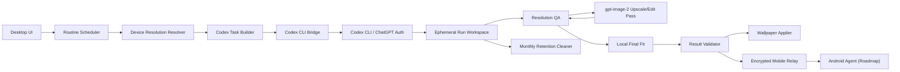

# Auto Ducktape Wallpapers 아키텍처

## 목표

Auto Ducktape Wallpapers는 사용자가 정한 루틴에 따라 Codex CLI를 호출해 `gpt-image-2` 바탕화면 이미지를 생성하고, 대상 기기의 해상도에 맞게 적용하는 데스크톱 앱이다.

핵심은 앱이 AI 제품이 되는 것이 아니라 **Codex CLI wrapper**가 되는 것이다. 앱은 일정, 대상 기기, 해상도, 적용 상태를 관리하고, 프롬프트 생성과 이미지 생성은 Codex에게 위임한다.

## 고정 원칙

- OpenAI API 직접 호출 없음
- OpenAI SDK 직접 사용 없음
- 이미지 프롬프트 생성도 Codex가 수행
- 이미지 생성도 Codex가 `gpt-image-2`로 수행
- 앱은 Codex 인증 파일을 읽거나 복사하지 않음
- 앱은 `codex exec` 실행과 결과 검증만 담당
- `gpt-image-2` 실패 시 다른 이미지 모델 fallback 없음
- 이미지는 로컬 애셋 라이브러리로 영구 저장하지 않음
- OS 적용에 필요한 runtime 파일만 일시적으로 사용
- 생성/후처리/보관/루틴 기본값은 루트 `settings.json`에서 수정 가능
- 모바일 원격 전달은 DB 없는 암호화 object relay만 사용
- relay는 Codex 실행, shell 접근, 임의 파일 읽기를 절대 노출하지 않음

## 시스템 구성



## 책임 분리

### Desktop App

- 루틴 생성/수정/삭제
- 스케줄 실행
- Windows/macOS 모니터 해상도 감지
- 스마트폰 모델명 기반 해상도 선택
- Codex 작업 명세 생성
- `codex exec` 실행
- JSONL 진행 상태 수집
- 결과 manifest 검증
- 생성 이미지 해상도 검증
- 기본 자동 루틴에서는 업스케일/편집 pass 없이 가장 나은 후보 이미지를 선택해 적용
- 고품질/수동 프로필에서만 같은 Codex 세션의 `gpt-image-2` 업스케일/편집 pass 요청
- 마지막 호환성 단계에서만 로컬 canvas fit 수행
- OS 바탕화면 적용
- Android target 산출물을 paired device용으로 암호화
- 다른 네트워크의 Android 기기에는 DB 없는 relay로 encrypted object 전달
- 월 1회 30일 초과 생성 이미지를 휴지통으로 이동
- 실패 로그 저장

### Codex

- simple instruction 해석
- advanced prompt 검토
- 이미지 생성용 최종 프롬프트 작성
- `gpt-image-2` 이미지 생성
- 설정에서 허용한 경우에만 생성 이미지를 다시 `gpt-image-2`에 입력해 고해상도 보강
- 대상별 이미지 파일 생성
- 파일명에 timestamp 포함
- 결과 manifest 작성

### Mobile Relay

- 다른 네트워크에 있는 Android 기기와 desktop app 사이의 이미지 전달만 담당
- 계정 DB, job DB, 이미지 메타데이터 DB를 두지 않음
- encrypted image object와 encrypted sidecar manifest만 임시 object storage에 저장
- object namespace는 high-entropy pairing secret에서 파생한 pair hash를 사용
- Android ack 이후 job object를 삭제
- ack가 오지 않아도 짧은 lifecycle retention으로 자동 만료
- Codex 실행, OpenAI credential 처리, 원격 shell, 임의 파일 접근은 제공하지 않음

### Android Agent

- 최초 pairing은 로컬 QR로 수행
- 실제 display metrics와 safe area를 desktop app에 등록
- relay 또는 LAN에서 pending wallpaper job을 pull
- 수신한 image payload를 로컬에서 복호화
- Android `WallpaperManager`로 home/lock wallpaper 적용
- 적용 성공/실패 ack를 desktop 또는 relay에 전달

## 실행 흐름

1. 사용자가 루틴을 만든다.
2. 스케줄러가 실행 시간을 감지한다.
3. 앱이 대상 기기의 최종 해상도를 확정한다.
4. 앱이 Codex 작업 명세를 만든다.
5. 앱이 `codex exec --json --sandbox workspace-write -`를 실행한다.
6. Codex가 프롬프트를 만들고 `gpt-image-2` 이미지를 생성한다.
7. Codex가 `manifest.json`을 작성한다.
8. 앱이 파일 존재, 해상도, 모델명, target 누락 여부를 검증한다.
9. 기본 자동 루틴에서는 target보다 작은 이미지도 best-available 후보로 즉시 선택한다.
10. 고품질/수동 프로필에서만 같은 Codex 세션을 유지한 채 `gpt-image-2` 보강을 요청한다.
11. 설정된 보강 횟수 이후에도 target 해상도 달성에 실패하면 가장 나은 후보 이미지를 선택한다.
12. OS 적용에 정확한 canvas가 필요하면 마지막 단계에서만 로컬 fit을 수행한다.
13. 검증이 통과하면 Windows/macOS 바탕화면에 적용한다.
14. Android target이면 desktop app이 paired device용으로 산출물을 암호화한다.
15. 같은 네트워크이면 LAN direct로, 다른 네트워크이면 DB 없는 mobile relay로 전달한다.
16. Android Agent가 복호화 후 바탕화면에 적용하고 ack를 보낸다.
17. 성공 후 runtime 파일을 정리한다.

## 설정 파일

루트 [settings.json](../settings.json)이 POC의 주요 동작을 제어한다.

- `codex`: `codex exec` command/args, `gpt-image-2` 모델 고정, fallback 정책
- `codex.timeoutSeconds`: Codex 생성 pass 무한 대기 방지
- `output`: 출력 디렉터리, manifest 경로, runtime 이미지 디렉터리
- `naming`: timestamp 포함 파일명 패턴
- `postProcessing`: 업스케일 시도 횟수, 실패 시 best-available fallback. 기본 자동 루틴은 0회
- `retention`: 월 1회 cleanup, 30일 초과 파일 휴지통 이동
- `mobileRelay`: DB 없는 암호화 object relay 설정
- `routines.demo`: dry-run에서 사용하는 기본 루틴, 10분 테스트 interval, 대상 기기

환경변수 `AUTO_DUCKTAPE_SETTINGS`로 다른 설정 파일을 지정할 수 있다.

## 프롬프트 모드

### Simple Mode

사용자는 짧은 지시사항만 입력한다.

예시:

```text
매일 아침 집중 잘 되는 차분한 배경
```

앱은 이 문장을 보존하고 `simplePromptRandomization` 후보 메뉴와 루틴별 `promptVariation` 슬롯을 Codex에 넘긴다. Codex는 이 정보를 바탕으로 중간 랜덤 스크립트를 직접 작성하고, 원래 지시사항과 함께 이미지 생성용 상세 프롬프트를 만든다. 파일명에 `{promptSlug}`가 있으면 Codex는 final prompt에서 안전한 짧은 slug도 생성한다.

### Advanced Mode

사용자가 직접 상세 프롬프트를 작성한다.

앱은 프롬프트를 수정하지 않고, 대상 해상도와 safe area 요구사항만 별도 필드로 전달한다. Codex는 사용자의 의도를 최대한 보존하면서 이미지 생성용 최종 프롬프트를 정리한다.

## 해상도 엔진

해상도는 생성 전에 반드시 확정한다.

```json
{
  "id": "galaxy-s24-ultra",
  "platform": "android",
  "model": "Galaxy S24 Ultra",
  "width": 1440,
  "height": 3120,
  "safeArea": {
    "top": 160,
    "right": 64,
    "bottom": 220,
    "left": 64
  }
}
```

### 데스크톱

- Windows: 모니터별 해상도와 DPI 감지
- macOS: display bounds와 scale factor 감지
- 멀티 모니터 모드:
  - 같은 이미지 반복
  - 모니터별 개별 이미지
  - span 이미지는 후순위

### Android

- 1차: 앱 내 스마트폰 모델 catalog
- 2차: Android Agent가 실제 display metrics 등록
- 3차: 사용자가 직접 해상도 입력

Android 전달 모드:

- 같은 네트워크: LAN direct sync
- 다른 네트워크: mobile relay sync
- relay sync는 이미지를 평문으로 저장하지 않고, DB 없이 encrypted object와 encrypted sidecar manifest만 보관한다.
- foreground realtime sync는 배터리 영향이 크므로 사용자가 명시적으로 켠 경우에만 사용한다.

## Mobile Relay 정책

서버는 모바일 기기를 위한 저렴한 중계 계층으로만 둔다. 제품 서버가 사용자 계정, 루틴, 장기 이미지 히스토리를 관리하지 않는다.

권장 provider는 Cloudflare Workers + R2이다.

- Workers: stateless HTTP relay endpoint
- R2: encrypted image object와 encrypted manifest sidecar의 임시 저장소
- R2 lifecycle: ack 누락 시 자동 삭제
- DB: 사용하지 않음

객체 구조:

```text
pairs/{pairHash}/devices/{deviceId}/jobs/{jobId}/manifest.json.enc
pairs/{pairHash}/devices/{deviceId}/jobs/{jobId}/wallpaper.png.enc
```

pairing:

- desktop과 Android가 로컬 QR로 high-entropy pair token을 교환한다.
- relay object namespace는 pair token hash에서 파생한다.
- remote pairing은 허용하지 않는다.

보안:

- 전송은 TLS만 허용한다.
- image payload는 relay 업로드 전에 end-to-end encryption을 적용한다.
- relay는 payload 내용을 해석하지 않는다.
- relay API는 job upload, latest poll, image download, ack/delete만 제공한다.
- remote에서 Codex 실행이나 desktop 파일 접근을 요청하는 API는 만들지 않는다.

### iOS

초기 범위에서 제외한다. 나중에 Shortcuts 기반 실험 또는 네이티브 앱을 별도 검토한다.

## 해상도 후처리 정책

정확한 target 해상도는 성공 조건이다. 후처리는 다음 순서로 수행한다.

1. **Native target generation**
   - Codex에 `gpt-image-2`로 처음부터 target 해상도 생성을 요청한다.

2. **Optional same-session GPT Image 2 upscale/edit pass**
   - 생성 이미지가 target보다 작으면 같은 Codex 세션을 유지한다.
   - 해당 이미지를 다시 `gpt-image-2` 입력으로 제공한다.
   - 프롬프트는 "preserve composition, preserve subject identity/style, enhance detail, output target resolution" 원칙을 따른다.
   - 이 단계는 다른 이미지 모델 fallback이 아니라 `gpt-image-2`를 이용한 보강이다.
   - 기본 자동 루틴에서는 꺼져 있으며, 고품질/수동 프로필에서만 설정된 횟수만큼 시도한다.

3. **Best available fallback**
   - 보강을 끄거나 target 해상도 달성에 실패하면 가장 나은 후보 이미지를 고른다.
   - 기준은 aspect ratio 근접도, 픽셀 면적, 시각적 적합성이다.
   - 루틴 작업이므로 토큰을 계속 쓰기보다 적당한 이미지를 적용한다.

4. **Local final fit**
   - OS wallpaper 적용에 필요한 정확한 canvas가 필요할 수 있다.
   - 이 경우에만 로컬 resize/crop/pad를 수행한다.
   - 로컬 fit은 세부 묘사 보강이 아니라 호환성 처리이므로 manifest `warnings`에 기록한다.

## 파일명과 보관 정책

생성 이미지 파일명에는 timestamp를 포함한다.

```text
{routineId}-{targetId}-{timestamp}.png
```

예시:

```text
morning-focus-main-monitor-20260504T061930Z.png
```

보관 정책:

- 생성 이미지는 runtime artifact이며 영구 컬렉션이 아니다.
- 단, OS가 현재 바탕화면 파일 경로를 참조할 수 있으므로 바로 삭제하지 않을 수 있다.
- 앱은 월 1회 retention cleaner를 실행한다.
- 생성 후 30일이 지난 이미지는 삭제하지 않고 시스템 휴지통으로 옮긴다.
- 휴지통 이동 실패는 debug 로그와 maintenance result에 기록한다.

## 저장 정책

영구 저장 대상:

- 루틴 설정
- 사용자 입력
- Codex에 전달한 작업 명세
- Codex가 작성한 최종 프롬프트
- 실행 결과 요약
- 실패 원인
- 대상 해상도
- 마지막 적용 시각
- 이미지 파일 timestamp
- retention cleaner 마지막 실행 시각

영구 저장하지 않는 대상:

- 장기 보관용 생성 이미지 원본
- 과거 이미지 히스토리
- 이미지 컬렉션
- mobile relay DB row

예외적으로 OS 바탕화면 적용 때문에 현재 파일 경로가 유지되어야 하는 플랫폼은 `current` runtime 파일 하나를 유지할 수 있다. 이 파일은 제품의 애셋 스토어가 아니라 플랫폼 제약 대응용 파일이다.

Mobile relay는 영구 저장소가 아니다. Android 전달을 위해 encrypted object를 잠깐 보관할 수 있지만, ack 또는 lifecycle 만료 이후 삭제해야 한다.

## 주요 실패 케이스

- Codex CLI 미설치
- Codex 로그인 만료
- `gpt-image-2` 생성 실패
- Codex가 manifest를 만들지 않음
- 생성 파일 누락
- 요청 해상도와 실제 이미지 해상도 불일치
- 같은 세션의 `gpt-image-2` 고해상도 보강 실패
- 후보 이미지 선택 실패
- 30일 초과 이미지 휴지통 이동 실패
- OS 바탕화면 권한 실패
- Android 기기 오프라인
- mobile relay 업로드 실패
- mobile relay object 만료 전 Android 미수신
- Android ack 실패 후 lifecycle cleanup 대기

## 확장 방향

- Android Agent
- Cloudflare Workers + R2 기반 mobile relay
- 날씨/시간대 기반 루틴
- 캘린더 기반 업무/휴식 배경
- 스마트폰 모델 catalog 원격 업데이트
- Codex Automations 연동
- iOS Shortcuts 기반 실험
