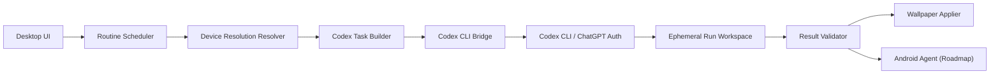

# Auto Ducktape Desktop 아키텍처

## 목표

Auto Ducktape Desktop은 사용자가 정한 루틴에 따라 Codex CLI를 호출해 `gpt-image-2` 바탕화면 이미지를 생성하고, 대상 기기의 해상도에 맞게 적용하는 데스크톱 앱이다.

핵심은 앱이 AI 제품이 되는 것이 아니라 **Codex CLI wrapper**가 되는 것이다. 앱은 일정, 대상 기기, 해상도, 적용 상태를 관리하고, 프롬프트 생성과 이미지 생성은 Codex에게 위임한다.

## 고정 원칙

- OpenAI API 직접 호출 없음
- OpenAI SDK 직접 사용 없음
- 이미지 프롬프트 생성도 Codex가 수행
- 이미지 생성도 Codex가 `gpt-image-2`로 수행
- 앱은 Codex 인증 파일을 읽거나 복사하지 않음
- 앱은 `codex exec` 실행과 결과 검증만 담당
- `gpt-image-2` 실패 시 다른 이미지 모델 fallback 없음
- 이미지는 로컬 애셋 라이브러리로 영구 저장하지 않음
- OS 적용에 필요한 runtime 파일만 일시적으로 사용

## 시스템 구성



## 책임 분리

### Desktop App

- 루틴 생성/수정/삭제
- 스케줄 실행
- Windows/macOS 모니터 해상도 감지
- 스마트폰 모델명 기반 해상도 선택
- Codex 작업 명세 생성
- `codex exec` 실행
- JSONL 진행 상태 수집
- 결과 manifest 검증
- OS 바탕화면 적용
- 실패 로그 저장

### Codex

- simple instruction 해석
- advanced prompt 검토
- 이미지 생성용 최종 프롬프트 작성
- `gpt-image-2` 이미지 생성
- 대상별 이미지 파일 생성
- 결과 manifest 작성

## 실행 흐름

1. 사용자가 루틴을 만든다.
2. 스케줄러가 실행 시간을 감지한다.
3. 앱이 대상 기기의 최종 해상도를 확정한다.
4. 앱이 Codex 작업 명세를 만든다.
5. 앱이 `codex exec --json --sandbox workspace-write -`를 실행한다.
6. Codex가 프롬프트를 만들고 `gpt-image-2` 이미지를 생성한다.
7. Codex가 `manifest.json`을 작성한다.
8. 앱이 파일 존재, 해상도, 모델명, target 누락 여부를 검증한다.
9. 검증이 통과하면 Windows/macOS 바탕화면에 적용한다.
10. 성공 후 runtime 파일을 정리한다.

## 프롬프트 모드

### Simple Mode

사용자는 짧은 지시사항만 입력한다.

예시:

```text
매일 아침 집중 잘 되는 차분한 배경
```

앱은 이 문장을 해석하지 않고 Codex 작업 명세에 그대로 넣는다. Codex가 이미지 생성용 상세 프롬프트를 작성한다.

### Advanced Mode

사용자가 직접 상세 프롬프트를 작성한다.

앱은 프롬프트를 수정하지 않고, 대상 해상도와 safe area 요구사항만 별도 필드로 전달한다. Codex는 사용자의 의도를 최대한 보존하면서 이미지 생성용 최종 프롬프트를 정리한다.

## 해상도 엔진

해상도는 생성 전에 반드시 확정한다.

```json
{
  "id": "galaxy-s24-ultra",
  "platform": "android",
  "model": "Galaxy S24 Ultra",
  "width": 1440,
  "height": 3120,
  "safeArea": {
    "top": 160,
    "right": 64,
    "bottom": 220,
    "left": 64
  }
}
```

### 데스크톱

- Windows: 모니터별 해상도와 DPI 감지
- macOS: display bounds와 scale factor 감지
- 멀티 모니터 모드:
  - 같은 이미지 반복
  - 모니터별 개별 이미지
  - span 이미지는 후순위

### Android

- 1차: 앱 내 스마트폰 모델 catalog
- 2차: Android Agent가 실제 display metrics 등록
- 3차: 사용자가 직접 해상도 입력

### iOS

초기 범위에서 제외한다. 나중에 Shortcuts 기반 실험 또는 네이티브 앱을 별도 검토한다.

## 저장 정책

영구 저장 대상:

- 루틴 설정
- 사용자 입력
- Codex에 전달한 작업 명세
- Codex가 작성한 최종 프롬프트
- 실행 결과 요약
- 실패 원인
- 대상 해상도
- 마지막 적용 시각

영구 저장하지 않는 대상:

- 생성 이미지 원본
- 과거 이미지 히스토리
- 이미지 컬렉션

예외적으로 OS 바탕화면 적용 때문에 현재 파일 경로가 유지되어야 하는 플랫폼은 `current` runtime 파일 하나를 유지할 수 있다. 이 파일은 제품의 애셋 스토어가 아니라 플랫폼 제약 대응용 파일이다.

## 주요 실패 케이스

- Codex CLI 미설치
- Codex 로그인 만료
- `gpt-image-2` 생성 실패
- Codex가 manifest를 만들지 않음
- 생성 파일 누락
- 요청 해상도와 실제 이미지 해상도 불일치
- OS 바탕화면 권한 실패
- Android 기기 오프라인

## 확장 방향

- Android Agent
- 날씨/시간대 기반 루틴
- 캘린더 기반 업무/휴식 배경
- 스마트폰 모델 catalog 원격 업데이트
- Codex Automations 연동
- iOS Shortcuts 기반 실험
